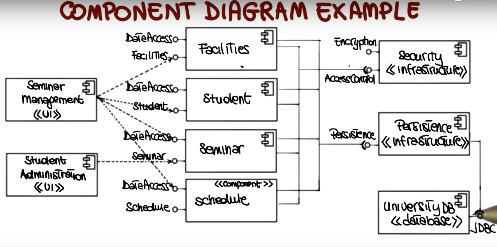
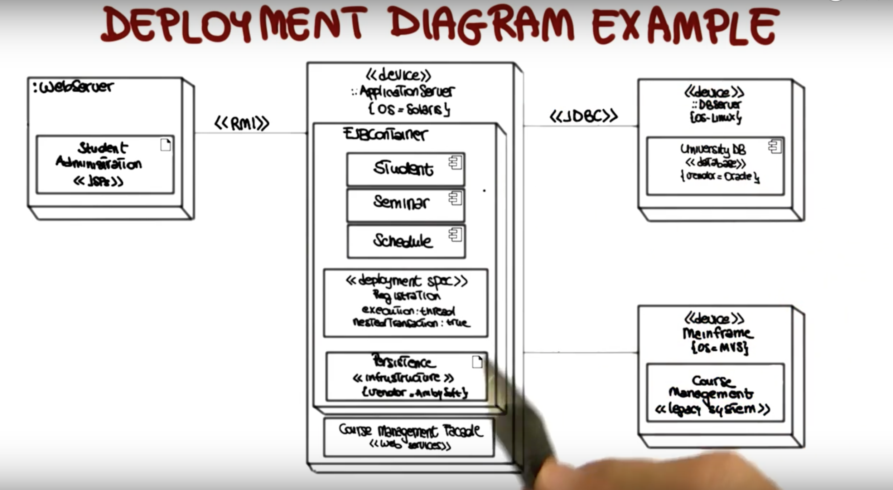
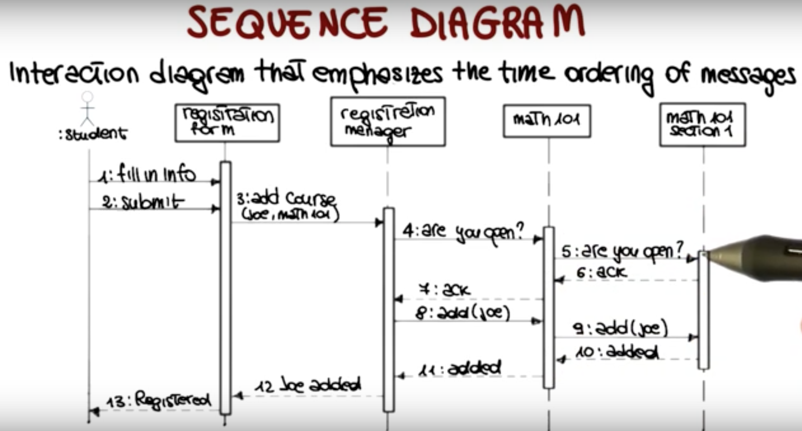
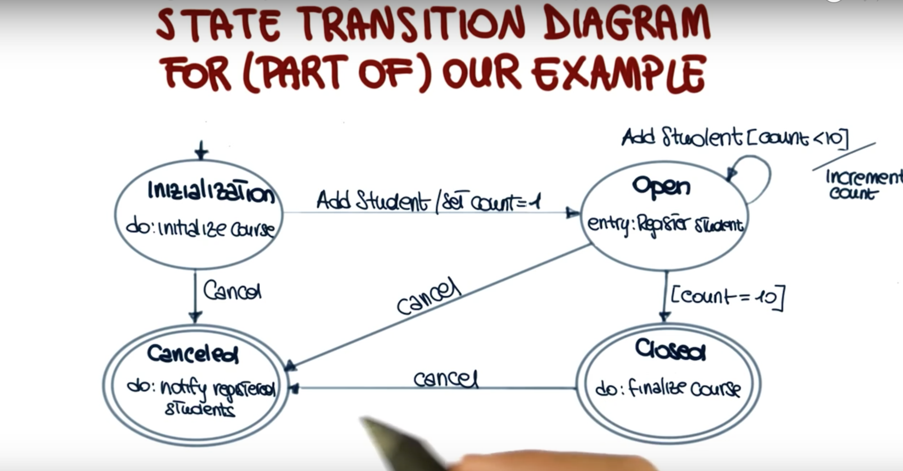

# Object Orientation

## Definition
- Value Data > Function
- Information hiding: Seperate data behind the wall
- Encapsulation
- Both Information and encapsulation: To gather and hide data behind a wall and provide data through well defined interfaces. 
  - Why? The system does not need concern the implementation behind the interface.
- Inheritance and Polymorphism

## Key Concepts
- Object: Instance variables and operations are invoked by sending a message.
- Class: a blueprint or template to create object.

## Benefits
- Reduce long term maintenance cost: esiear to modify part of the system without affecting others
- Improve development process
- Enforce good design

## OOAD
An SWE Approach that models software systems as a group of interacting objects. (using nodes and edges)

### OO Analysis History
James E. Rumbaugh divides OOAnalysis into 3 aspects as part of the OMT (Object Modeling Technique)
- Data: Object model
- Functions: Functional Model
- Control: Dynamic model of the System. Shows what state the system go through using state machine. Show how the system evolves.

Then later, Jacobson and Booch invented Unified Modeling Language extends OMT.

How to OO Analysis: 

**We go from Functional Oriented => Data Oriented.** 

Idea: Focus on real world object.
1. Obtain/prepare textual description of problem.
1. Underline nouns => Classes
1. Underline adjectives => Attributes
1. Underline active verbs => Operations

__Running Example through out the UML Tutorial:__
``` markdown
### Course Management System
1. The registration manager sets up the curriculum for a semester using a scheduling algorithm
2. One course may have multiple course offerings
3. Each course offering has a number, location, time
4. Students select 4 primary courses and 2 alternative courses
5. Students may use the system to add/drop courses for a period of time after registration
6. Professors use the system to receive their course offering rosters
7. Users of the system are assigned passwords which are used at logon validation.
```
 
---
# Unified Modelling Language
# __Structural Diagrams__: 
represent static characteristic of the system.

## UML 1: Class Diagram: 
Static structural view of the system that models the following:
* Classes and their structure
* Relationship between classes

### 1. Class: 

| Class Name |
|:-- |
| - Atrribute <br/> - attributed: type = initial value <br/> ...|
| + operation(arg-list): result-type <br/> ...|   

- **\+** is public
- **\-** is private

Normally, the operations' cell is the interface of the system design. 

``` markdown
#### My Course Management Analysis Solution
Take the description and figure out useful details

Course Management System Requirements: 
1. The ___Registration Manager___ sets up the ___curriculum___ for a ___semester___ using a ___scheduling algorithm___ 
1. One ___course___ may have multiple ___course offerings___
1. Each course offering has a ___~~course~~ number___, ___location___, ___time___
1. ___Students___ select 4 primary courses ~~offerings~~ and 2 alternative courses ~~offerings~~
1. Students may use the system to add/drop courses for a period of time after registration
1. ___Professors___ use the system to receive their ___course offering rosters___
1. Users of the system are assigned ___passwords___ which are used at logon validation.

Results:
The following things are considerred as a class
-  Registration Manager
-  Curriculum
-  Semester
-  Scheduling Algorithm (could be an attribute though?)
-  Course
-  Course Offering
-  Course Number, Location, Time (Attribute?)
-  Students
-  Professors
-  Course Offering Rosters
-  Passwords (an attribute?)

```

### 2. Attributes
Represents the Structure of a class

How to find?
- Examine the class definitions
- Study Requirements
- Applying domain knowledge: important aspects might not be provided in the requirement. 

``` markdown

The Course Offering example: 
1. Each course offering has a ___~~course~~ number___, ___location___, ___time___

will results in a class diagram like this 
__________________
| CourseOffering |
| -------------- |
| - course number|
| - location     | 
| - time         |
__________________

The type is not necessary provided. 

```

### 3. Operations
Represents the behaviors of the class
When examing a requirement, if we find an operation, adding an operations may further implies adding many operations in different classes (or a same class).

``` markdown
1. Students may use the system to add/drop courses for a period of time after registration

results in

|----------------------------|
| Registration Manager       |
| --------------------       |
| --------------------       |
| addStudent(Course, Student)|
|----------------------------|

also
- addStudent(Student) in Course class
- addStudent(Student) in CourseOffering class

```

### 4. Relationship
Describe interaction between the class
1. Dependencies: X uses Y -------> dashed directed line
1. Associations/Aggregations: X has a Y 
    *  Association: ____________ or solid indirected line
    *  Aggregation: _________<> 
1. Generalization: X is a Y _____________|>

---
1. Dependency Relationship: as long as a class refers to another class they have a dependency relationship. Once the "dependee" is changed the dependent is changed affected.
    *  `Example: RegistrationManager -----> SchedulingAlgorithm meaning The RegistrationManager uses a SchedulingAlgorithm class to schedule hence the RM is dependent on the SchedulingAlgorithm.`
    *  **Implication**: The class being dependent on is a parameter/argument/returned value to an operation of the dependent implementation-wise.
1. Association Relationship: Object(s) of one class have object(s) of another class. 
    *  Use adorement to clarify the meaning of the association. Adding a label to name it
        *  `Example: Student _____registered for____ Course Offering`
    *  Use a triangle to clarify the direction of the relationship. 
        *  `Example: Student _____registered for____|> Course Offering`
    *  Use multiplicity to clarify the relationship of 1 class corresponding to the amount of instance to the other class.
        *  `Example: Student 1..50__registered for__2..*|> Course Offering meaning that a student can registers at least 2 classes and more while a class can have from 1 to 50 students.`
    *  **Implication:** 
        *  Association also means: an implicit dependency relationship of one class to the other
        *  One class should have the other as properties/attributes/fields implementation-wise!
    1. Aggregation: a specialized association. A relationship between 2 classes where one is a part of a larger classes ( we cannot have the other (larger) class constructs this (smaller) one)
        *  ` Example: Course <>___________ Course Offerings describes a course consist of multiple offerings`
1. Generalization Relationship: describes inheritance.
    *  `Example: Student __________|> RegistrationUser`
    *  **Implication**: also implicitly describes a dependency relationship.

### Tips:
- Understand the problems
- Choose good names
- Concentrate on the what
- Start with KISS diagram 
- Refine the diagram as we gather more requirements until we feel it's complete.

## UML 2: Component Diagram:
Static view of components and their relationships. 

In this diagram:
1. Node = Component: a set of classes (in the class diagram design step) with a well-defined interface
1. Edge = Relationship: "uses of" relationship.

Can be used to represent an architecture of the software.

Course Management Example:


From the example: 
- A component is a box with one or more exported interfaces. 
- Another component may use dependent on relationship to exhibit that it uses those interface. 

## UML 3: Deployment Diagram
- Static deployment view of a system
- Physical allocation of components to computational units (which components go to the server and which go into the client)
- In this diagram: 
    - Node: The computational unit
    - Edge: Communication method

Course Management Example:


# Behavioral Diagrams
describes the dynamic aspects of the systems

## UML 4: Use Case Diagram
Describes the outside view of the system

- Sequence of interactions of outside entities (actors) with the system.
- System actions that yields an observable result of value to the actors

``` markdown
    1. NODES:

    /------------\
   |     Name     | Use case
    \------------/

     0
    /|\  Actors
    / \


    2. EDGES:
    ______ "is actor of " relationship

 ```

 ### 1. Actor:
 Entity: human or a device 
 -  plays at least one role.
 -  and multiple entities can play the same role.
 .i.e. A customer, or an employee. 

Course Management Example:
 ``` markdown
#### My Course Management Analysis Solution
Take the description and figure out actors

From the Requirements: 
1. The ___Registration Manager___ sets up the curriculum for a semester using a scheduling algorithm
...
4. __Students__ select 4 primary courses offerings and 2 alternative courses offerings
...
6. __Professors__ use the system to receive their course offering rosters

```
And we get 3 actors:

|o<br/>/\|\  Actors<br/>/ \ | o<br/>/\|\  Reg. Man.<br/>/ \ |o<br/>/\|\  Professors<br/>/ \ |
|-|-|-|

```
                          ___________________
     0                   /                   \
    /|\  Student _______|  Maintain Schedule  |
    / \                  \___________________/

        /----------------------\           0
        | RequestCourse Roster |_______   /|\  Professor
        \---------------------/           / \
                            ___________________
     0                     /                   \
    /|\  Registrar _______|  Maintain Schedule  |
    / \                    \___________________/
```

### 2. Building Use case

The behavior of a use case can be **further** specified by describing its flow of events
- How the use case starts and ends
- Normal flow of events (insert card, provide PIN)
- Alternative flow of events (want some info like how much money in my account? if I want to withdraw?)
- Exceptional flow of events (.i.e. wrong PIN)

The behavior can be either formally or informally written

Course Management Example:
``` markdown
1. Registrar - set up the curriculum
    1.Registrar logs onto the system and enters password
    2.1 If password is valid, system asks to specify a semester
        2.1.1 System prompts the registrar to select the desired activity: ADD DELETE REVIEW or QUIT
        2.1.2. Registrar selects
            2.1.2.1 ADD: System allows registrar to add a course to the course list
            2.1.2.2 DELETE: System allows registrar to delete a course from course list for the selected semester
            ...
    2.2
    

```

### 3. Role of Use Cases

1. Requirements Elicitation: Much easier to describe requirements by describing the scenario of usage (good for verification in RE)
1. Architectural analysis: identify the main block of the system
1. User prioritization: Prioritize for the user (actors) importance. (.i.e. bank administrator can be built first)
1. Planning: after prioritization we know which component can be implemented first.
1. Testing: Define test cases even before.

### 4. TIPS for creating:
- Use name that communicates purpose (purpose of the software)
- Define one atomic behavior per use case
- Define the flow event clearly
- Provide only essential details
- Factor variants

## UML 5: Sequence Diagram:
Interaction diagram emphasizes the time ordering of messages between objects.

Course Management Example:


## UML 6: State Transition Diagram:
For each relevant class (logical-wise but not implementation wise), build a state machine that:
- List all possible states of the class
- All events that cause a transition from one state to another
- All Actions that result from a state change.

```
/------\  event(attrs)[cond]/    /-------------\
|State1|_______________________> |  State2      |
\------/        action1          | entry/action |
                                 | do:activity  |
                                 | event/action3|
                                 | exit/action4 |
                                 \--------------/
```
1. event(attrs)[cond]/action1
    * event: the event that triggers the state change 
    * attrs
    * cond: the boolean condition which must holds for this transition to occur
    * action1: the action occurs during transitioning
1. entry/action: the action occurs on entering this state
1. do:activity: the long running task that is conducted when the state is held
1. exit/action: the action occurs on exiting this state.
1. event/action3: when a specific event occurs that does not move the object to another state.

Course Management Example: 



> PHEW!!! This is tooooooo long :)