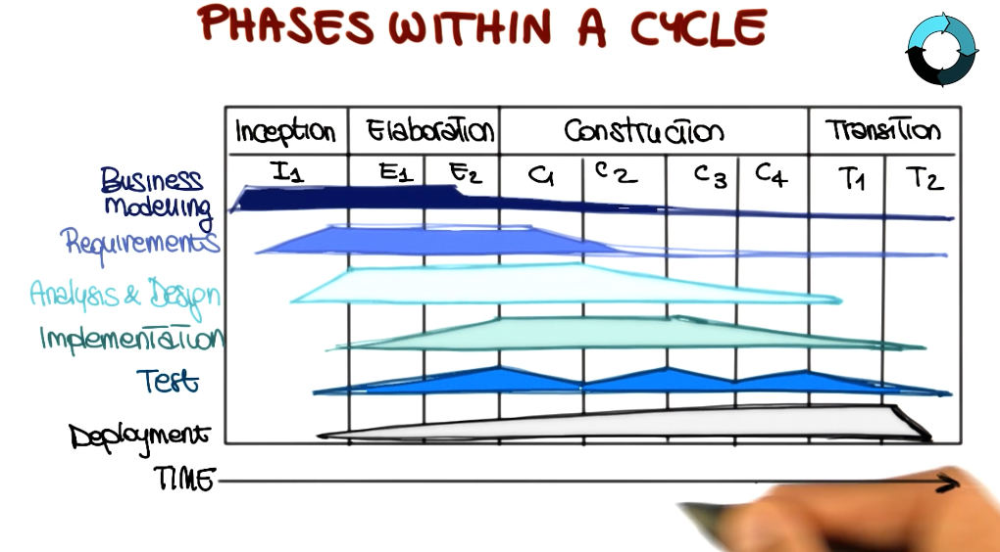

# Outline
1. Software Design
1. Unified Software Development Process
1. More Complex Project that builds distributed software system that involves different platforms

# Software Architecture
Architectural design decision is the principle design decision.  
A system can be successful but poorly architected.

***Architecture Erosion***: 
Imagine buy a decent car. At one point you must upgrade the engine, then replace the side mirror, then cut the roof of the car.\
In the end, you get a car still your car but the behavior changed. Sometimes, it's hard to make a turn. 

## Definition
1. Perry and Wolf: SWA = {Elements, Form, Rationale}
    *  Elements: What - the processes, data, connectors
    *  Form: How - properties and relationship
    *  Rationale: Why - justification of the element and their relationship
1. Shaw and Garland: SWA is a level of design that involves:
    *  Description of elements from which systems are built
    *  Interactions among these elements
    *  Patterns that guide their composition
    *  Constraints on these patterns
1. In This Class: A set of principal design decisions about the system. 
    * When we design a system, we make tons of decisions and most of them do not affect the architecture of the system, but some of which do affect.
    * Blueprint of a software system, incompasses every facets of the system:
        * Structure
        * Behavior
        * Interaction
        * Non-functional properties
    * Temporal Aspect: Is not defined at once, but iteratively over time. \
    At any point in time a SWA, but it will change over time. \
    Design decisions are made, unmade, and changed over a system lifetime.

2 main standpoints:
1. Prescriptive: captures the design decisions made prior to the system's construction. => as-conceived SWA 
1. Descriptive: describes how the system has actually been built => as-implemented SWA

## Architectural Evolution
When the system evolves, ideally its prescriptive architecture should be modified.
` Example: when we modify a system we change the blueprint, but rarely change the building.`
Descriptive architecture is changed due to:
1. Developer's sloppiness
1. Short deadlines
1. Lack of documented prescriptive architecture

## Architectural Degradation
1. ***Architectural drift*** introduction of architectural design decisions orthogonal to a system's prescriptive architecture. Add components that have nothing to do with the prescriptive design
1. ***Architectural erosion*** introduction of architectural design decisions that violate a system's prescriptive architecture. Implement the components in a way that violates the given prescriptive design.

Results: degraded architecture.
***Recovery***: determine the SWA from the implementation then fix it to follow the prescriptive architecture.

### Real-world Example: 


Three Characteristics:
1. Scalability
1. High cohesion
1. Low coupling

## Software Architecture's Elements
Not monolith, but a composition and interplay of different elements
- Processing Elements: implement business logic, perform transformation of data.
- Data Elements: (info or state) Contains info used and transformed by processing elements.
- Interaction Elements: Form and hold different pieces of architecture together.

Processing and Data are ***components*** of a system
Interaction is maintained by system ***Connectors***
Components + Systems = Configurations

## Software Components, Connectors and Configurations
1. Software Component: architectural entity that
    - encapsulates a subset of the system's functionality and/or data
    - restricts access to that subset with an explicitly defined interface
1. Software Connector: architectural entity effecting and regulating interaction.
1. Architectural configuration: association between components and connectors of a software architecture.

## Architectural Styles

Captures ideas when designing a system.
1. Pipes and filters: output of one element is input of another element
    *  `Example: Process pipe or pipe of programs running in shell`
1. Event-driven: consists an event and an event consumer. A consumer has a responsibility to respond to events of interest.
    *  `Example: GUI`
1. Publish-subscribe: Senders of messages do not send messages directly to a specific receivers, but to a channel to distribute it to clients who interest.
1. Client-server: one or two roles: serving or consuming.
1. Peer-to-peer: both serving and consuming. 
1. REST: Representational State Transfer: uniform connector interface. 

### Peer-to-peer (P2P) Architectures:
Decentralized resource sharing and discovery
Two representative examples:
- Napster:
    - Peer to peer file sharing system. 
    - Sued and ceased to exist
- Skype: almost fully P2P
    - An interconnected set of supernodes as peers
    - A bunch of other peers connected to supernode as client-server.

### Final notes
1. A great architecture is a ticket to success
1. A great architecture reflects deep understanding of the problem domain
1. A great architecture combines aspects of several simpler architectures


---
# Design Pattern

# History of Design Patterns

1977 Christopher Alexander introduces the idea of patterns: successful solutions to problems

1987 Ward Cunningham and Kent Beck leverage Alexander's idea in the context of an OO language

1987 Eric Gamma's dissertation an importance of patterns and capture them. 

Enrich Gamma
Richard Hem
Ralph Johnson
John Vlissides 
(gang of four)

# Patterns Catalogue
1. Fundamental
1. Creational: Handle object creation
1. Structural: Compose objects
1. Behavioral: Realize interaction among objects
1. Concurrency: Support concurrency

# Format(Subset) 
1. Name
1. Intent
1. Applicability
1. Structure
1. Sample Code

# Some Patterns

## Factory Method
1. Intent: Allows for creating objects without specifying their class, by invoking a factory method 
1. Applicability:  
    - Class can't anticipate the type of objects it must create at compile time. (use abstract interface?)
    - Class wants its subclasses to specify the type of objects it creates
    - Class needs control over the creation of its objects
1. Structure:
    - 
1. Participants
    - Creator: provides interface for factory method
    - ConcreteCreator: provides method for creating actual object
    - Product: object interface for instances created by factory method
1. Sample Code:
```java
public class ImageReaderFactory{
    public static ImageReader createImageReader(InputStream is){
        int imageType = getImageType(is);
        switch(imageType){
            case ImageReaderFactory.GIF:
                return new GifReader(is);
            case ImageReaderFactory.JPEG:
                return new JpegReader(is);
        }
    }
}
```

## Strategy Pattern
Configure the class with one or many behaviors

1. Itent: Allows for switching between different algorithms for accomplishing a task
1. Applicability:   
    - Different variants of algorithm
    - Many related classes differ in their behavior
1. Structure: 
    - 
1. Participants:
    - Context: interface to the outside world (the container of this pattern)
    - Algorithm(Strategy): common interface for the different algorithms
    - Concrete Strategy: actual implementation of the algorithm. 
1. Sample Code:
    ``` java
    public class Context {
        private Strategy stra;
        // In this case the client gives the strategy to the Context class
        public Context(Strategy stra){
            this.stra = stra;
        }
        public interface Strategy{
            public void call();
        }
        public class FilterStrategy implements Strategy{
            public void call(){
                System.out.println("Filter Strategy");
            }
        }
        public class FindStrategy implements Strategy{
            public void call(){
                System.out.println("Find Strategy");
            }
        }
    }
    ```
## Other patterns: 

### Visitor Patterns
A way of separating an algorithm from an object structure on which it operates. 

### Decorator
a wrapper that adds functionality to a class. This pattern is stackable.

### Iterator
Access elements of a collection without knowing the underlying representation.

### Observer
Notify dependents when object of interest changes. 

Example: There's a folder and this folder notifies when something changes. 

### Proxy Surrogate 
controls access to an object. 

## How to Choose a Pattern

- Understand design context
- Examine the Pattern Catalogue
- Identify and study related patterns
- Apply suitable pattern

---

# Rational Unified Software Process
RUP 

## History: 
In 1997 Rational defined six best practices for modern software engineering
1. Develop interactively, focusing on risk
1. Manage requirements
1. Employ a component-based architecture
1. Model software usually
1. Continuously verify the quality of the software
1. Control changes

## Key Features of RUP

Software Process Model:
- Define the order of software process phases
- Transition Criteria: when to go from one phase to the next
- 
Component based: 
- Built as a set of software components
- Built on well-defined interfaces

Tightly related to UML:
- Notation
- Basic principles

Distinguishing aspects:
- Use-case driven
- Architecture-centric
- Iterative and incremental

| USE CASE | ARCHITECTURE |
| - | - |
| The Function | The Form |

## Benifits:
- Early feedback
- Minimize the risk of developing wrong system
- Accommodate evolving requirements

## Use-case Driven
A system performs a sequence of actions in response to user input

Use cases capture this interaction and answer the question "what is the system supposed to do for each user?"

Use case is at the center of all the phases of the software development life cycle: Requirements Engineering => Design => Implementation => Verification and Validation => Maintainence.

## Architecture Centric

A view of the entire system that represents all high level principal design decisions. 

Happens in an iterative fashion
- Create a rough outline of system.
- Key use cases => main subsystems
- Refine architecture using additional use cases

## Iterative and Incremental

Software Project: consider the life time of the software project. 
Cycle 1
Cycle 2
...
Cycle n

Each cycle results in a product release. 
Each cyle is further divided in 4 phases:
1. Inception
1. Elaboration
1. Construction
1. Transition

Inside each phase there may be mulriple iterations. For each iteration, we select the most risky use case, then the following have less risks.


Each cyle focuses different part of the system. There is a little bit of overlapping parts.

## Phases within a Cycle



## Iterations

- Identify relevant use cases: identify which piece of functionality to focus on.
- Create the design
- Implement the design
- Verify code against use cases
- Release a product at the end

## Phases
### 1. Inception Phase

What to be done: 
1. From the idea to vision of the end product
1. Delimit project scope
1. Business case for the product presented

Answer 3 questions:
- What are the major users and what will the system do for them? 
Simplied the use-case model.

- What could be an architecture for the system?  
Tentative architecture.

- What is the plan and how much will it cost?  
Main risks identified and rough planning.

Generates multiple deliverable:
Vision document with general vision of the core project's requirements, key features, and main constraints

- Initial use-case model: will be later refined.
- Initial project glossary: main terms using in the project and meaning
- Initial business case: business context and success criteria
- Initial project plan and risk assessment: 
    - Plan: show phases, iterations, roles of the participants, and initial estimates
    - Risk: main risks and counter-measure

[Optionally] One or more prototypes: to address some specific risks. 

Evaluation criteria (complete before moving on): 
1. Stakeholder concurrence agrees on the scope definition and cost/schedule estimates
1. Requirements understanding as evidenced by the fidelity of the primary use cases
1. Credibility of the cost/schedule estimates, priorities, risks and development process
1. Depth and breadth of any prototype that was developed

Project maybe canceled or considerably rethought if it fails to pass this milestones.

### 2. Elaboration Phase

What to be done: 
- Analyzing problem domain
- Establish a solid architectural foundation
- Eliminate highest risk element (address most critical use cases)
- Refine the plan of activities and estimates

Produce these artifacts/deliverable: 
- Almost complete use-case model
- Supplementary requirements, including non-functional
- Software Architecture

Outcome:
- Design model, test cases, executable prototype.
- Revise project plan and risk assessment
- Preliminary user manual

Evaluation Criteria:
1. Are vision and architecture stable?
1. Does the prototype show that the major risks have been addressed resolved?
1. Is the plan sufficiently detailed/accurate?
1. Do all stakeholders agree that the vision can be achieved with the current plan?
1. Is the actual resource expenditure versus planned expenditure acceptable?

### 3. Construction Phase

What to be done:
- Most of the features are devleoped
- All features are thothroughly tested

Outcomes:
- The phase generates all the following outcomes. All use cases realized, with traceability
- Software profuct integrated on adequate platforms
- Complete system tests results
- User manual
- Complete set of artifacts: design, code, test cases.

Evaluation Criteria:
- Is the product stable/mature enough to be deployed to users?
- Are stakeholders ready for transition into user community?
- Are actual resource expenditures vs planned expenditures still acceptable

Transition my be postponed if the criterions are not met

### 4. Transition Phase
What to be done: 
- Issues after deployment => new release.
- Users report errors, improvements, new feature requests. 
- Training customer service and providing help line assistance
- A new cycle may start.

Outcome: 
- Project completed
- Product in use
- Lessons Learnt

Evaluation:
- Is the user satisfied
- Are actual resource expenditures vs planned expenditures still acceptable?