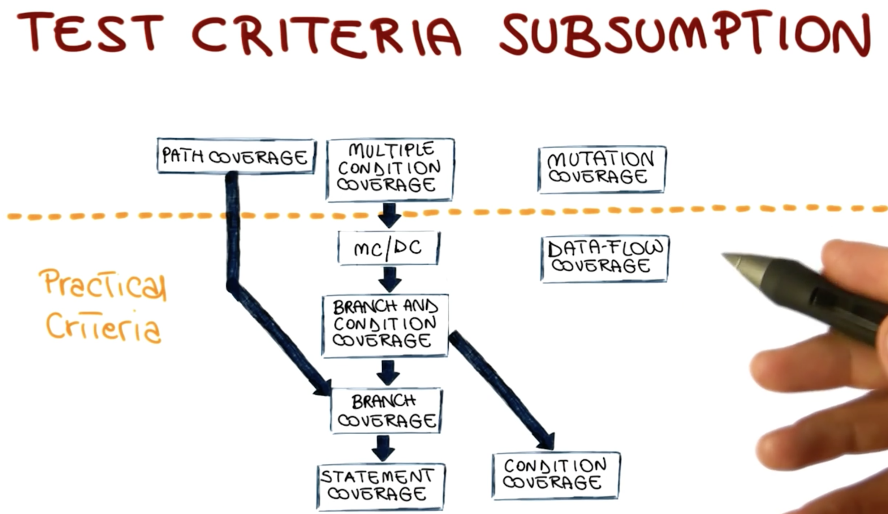

# Software Testing

Some examples:
Software is Buggy.
We must verify the software as much as possible.

Different alternative ways to verify:
1. Failure: Observable incorrect behavior 
1. Fault(bug): Incorrect code
1. Error: cause of a fault

Example:

```c
        int doubleValue(int i){
                int result;
                result = i * i;
                return result;
        }
```
- A call to doubleValue(3) returns 9 is a failure. 
- ` result = i * i; ` is a fault
- We don't really know the error here? Could be a type, or conceptual etc. The developer can only answer the question.

# Software Verification

4 main approaches:
1. Testing or Dynamic Verification
    - try to make the system fail.
    - Input Domain D => Software => Output Domain O \
      Test case: {in in D, out in O} \
      Test suite: a set of test cases.
1. Static verification
    - Consider all possible inputs (executions). Unlike testing, It is complete.
1. Inspections
    - Human intensive activity.
    - Manual and group activity.
    - Several people of the development team look at the code or artifacts and try to identify the defects in them.
1. Formal Proofs of Correctness
    - Given the specification and the program, we perform a mathematical approach to prove 

# Pros and Cons of techniques:

| |Testing| Static Verifcation| Inspections |Formal proof |
| - | - | - | - | - |
|Pros | No false positives: testing generates failures means there is an actual| Consider all program behaviors | Systematic, Thothrough | Strong Guarantees |
| Cons| Highly incomplete | Can generate false positives | Informal and Subjective | Complex, Expensive |

Bill Gates:
> 50% of our staff are testers, the other 50% spend most of their time testing.

# Developer's Testing

Executing a program on a ***tiny*** sample of the input domain
1. A dynamic technique: Program must be executed in order to be tested 
1. Optimistic approximation: Program exercised with a small subset of possible inputs. The behavior with any other input is consistent with any subset of input data.

If a set of test does not produce any error means it can show there is a problem with the program.

### Granularity Levels:
1. Unit Testing: A single module is tested in isolation
1. Integration Testing: multiple modules at the same time 
    - Big Bang testing: integrate all the modules at once.
1. System Testing: Complete the system testing as a whole which includes functional and non-functional testing.
    - Functional test: Test to verify the functionality provided by the system. 
        .e.g: doubleValue provides the good output
    - Nonfunctional test: targets non functional parts: performance, load, robustness. Basically, it targets: reliability, maintainability, usability or whatever *-ility it is.
1. Acceptance Testing: validation of software against customer's approval
1. Regression Testing: performs every time we change the system. Make sure the changes behave as intended and other components are not affected. 
    - Regression error: the change in some code broke some functionalities -> cause bugs. This is why maintenence is so expensive.
    - Example: the second software update causes error.
    - Use scripts and tools to save tests and reuse them later

# Alpha and Beta Testing
4 levels of subsetting:
1. Testing
1. Alpha Testing: By distributing the software to the users that are internal to the company
1. Beta testing: select a subset of users outside the organization.
1. Product Release

# Black and White Box Testing

Two main families of testing technique:
Black-box testing: 


| | Black-box testing | White-box Testing |
| - | - | - | 
| Idea | Consider the software as a closed-box | Look inside the closed box |
| Based on | Based on a description of the software (specification) |  Based on the code |
| | - Cover as much specified behavior as possible <br/> - Cannot reveal errors due to implementation details | - Cover as much coded behavior as possible <br/>- Cannot reveal errors due to missing paths |
|Advantages|- Focus on the domain<br/> - No need for the code (early test design)<br>- Catches logic defects<br/> - Applicable at all granulity levels| - Based on the code so can be measured objectively, can be measured automatically<br/>- Can be used to compare test suites<br/>- Allows for covering the coded behavior|

## Black-box testing example:
Specification: Inputs an integer and prints it

Possible implementation
```c
        void printNumBytes(int param){
                if (param <1024) printf("%d", param);
                else printf("%dKB", param/124);
        }
```

In this code, numbers smaller 1024 are treated differently than those \> 1024 which contradicts with the requirement. But the error can't be seen if all test cases are \< 1024.

With black-box testing, we have all the test cases from smallest integer to the largest.

## White-box testing example: 

Specification: inputs an integer param and returns half of its value if even, its value otherwise.

```c
        int fun(int param){
                int result;
                result = param/2;
                return result;
        }
```
Without specification, and look at the code, and try to execute them manually, we will see it runs perfectly fine.

# Black-box Testing (aka Functional Testing)
To go from Functional Specification to Test Cases
Steps: 
1. Identify independently testable features 
    *  `printSum(int a, int b)` has one testable feature: returns sum of 2 numbers 
1. Identify the relevant inputs: Test Data Selection problem.
    *  Exhaustive Testing: too many inputs -> too much time to test 
    *  Random Testing: pick inputs uniformly 
    *  Partition Testing:  
       1. Identify partitions of the domain
       1. Select inputs from each partitions
        * ` Example: func split(str string, size int), Some possible partitions are size < 0, size > 0, size = 0, str with len(str) < size, str with len(str) in [size, size*2], str with len(str) > size*2.
        Some possible inputs at the boundary: size = -1, size = 1, size MAXINT.`
        * Error tends to occur at the boundary of a subdomain because developer tends to not understand this area. `Example: the end of the loop. `=> Select input at these boundaries.
1. Then test case specifications: the combination of test data to form a solid test input. Also elliminate test input that does not make sense. 
1. Generate test case

## The Category-Partition Method
Specification -> 6 steps -> Test case
1. Identify independently testable features
1. Identify categories: category = the characteristics of each input element
    *  ```Example: split(str string, size int) 
        string has two characteristics: content, length  
        size has one: value```
1. Partition categories into choices/properties/domains/characteristics: identify interesting cases (dubdomains of each categories)
    *  ``` func split(str string, size int) 
        string has two characteristics:
        string: 
            length:
                - 0 [PROPERTY zerolength]
                - size - 1
                ...
            content:
                - spaces [IF !zerolength]
                - special characters [IF !zerolength]
        int:
            value:
                - 0 [ERROR]
                - > 0
                - < 0
                - MAXINT
1. Identify constraints among choices:
    - To eliminate meaningless combinations
    - To reduce the number of test cases
        - Use 3 property types: PROPERTY...IF, ERROR, SINGLE
            - PROPERTY name: assigns a choice a property name
            - IF condition (.i.e condition can be !property1 ): to includes this property when some property is picked
            - ERROR: selects this property to be in one combination because we know this property generates an error.
            - SINGLE: similar to error, choices that should not be combined with other choices.
1. Produce/Evaluate test case specifications
    - Can be automated with declarative programming
    - Produces test frames (with a sequence number) that specifies the characteristics of the input of that frame. 
        - Example: 
        ```Test frame #36: 
            input str
                length: size - 1
                content: special characters
            input size
                value: > 0
        ```
1. Generate test cases from test case specifications:
    - Simple instantiation of frames: use specific values instead of descriptions
    ```
        Test case #36
            str = "ABCC!\n\t\0"
            size = 10
    ```

```Example with tsl generator
    Write test cases for grep program - search a file for a pattern. 
```

## Model-based Testing:
Identify relevant inputs in the Category Method can be done in a different way: Constructing a model. 

Specification => Model => Test Cases.

### Finite State Machines (FSM)
Use a finite state machine as a model to produce test cases

A test case would be a complete or partial cycle of state path that traces from the initial state to the final state. The test will pass if the final state we receive is the one we expected.

The amount of test cases can get complicated based on how complicated we model the system. (how many smaller states we want to have and test.)

# White-box Testing

3 Techniques:
1. Control-flow based
1. Data-flow based
1. Fault based

## Coverage Criteria

```go
func printSum (a int, b int){
    result:= a + b
    if result > 0{
        fmt.Println("red", result)
    }else if result < 0{
        fmt.Println("blue", result) 
    }
}

```

Defined in terms of test requirements  
Result in test specifications, test cases

### Statement Coverage:
- Most used in industry
- Typical coverage target is 80-90%

***Test Requirements***: instructions in the program  
***Coverage Measure***: number of executed statements/total number of statements.

### Control Flow Graph
use to reason the code written


### Branch Coverage
***Test Requirements***: branches in the program  
***Coverage Measure***: number of executed branches/total number of branches
If we get 100% branch coverage, we have 100% statement coverage. 
In order to achieve branch coverage, it takes a larger amount of test cases. 

### Condition Coverage
***Test Requirements***: individual conditions in the program is recorded (this also includes subconditions in a bigger one. `Example: ((x==0) && (y==1)) counts as 2 conditions`)  
***Coverage measure***: number of conditions that are both T and F/total number of conditions

Condition Coverage does not imply Branch Coverage. So we have condition and branch coverage. 

Branch and Condition Coverage => Branch Coverage => Statement Coverage.

### Modified Condition/Decision Coverages
Key idea: test important combinations of conditions and limited testing costs.
Extend Branch and Decision Coverage with the requirement that **each condition should affect the decision outcome independently.**

Isolate each condition

### Other Criteria
- Path Coverage
- Data-flow Coverage
- Mutation Coverage

## Criteria Hierarchy


The Theoretical Criteria (above the practical line) are too expensive to implement.